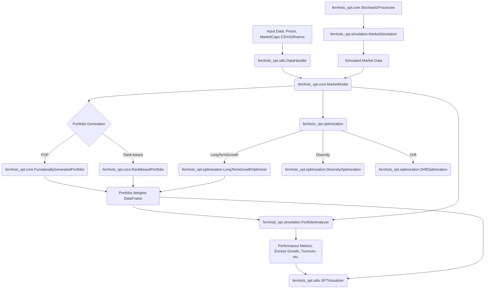
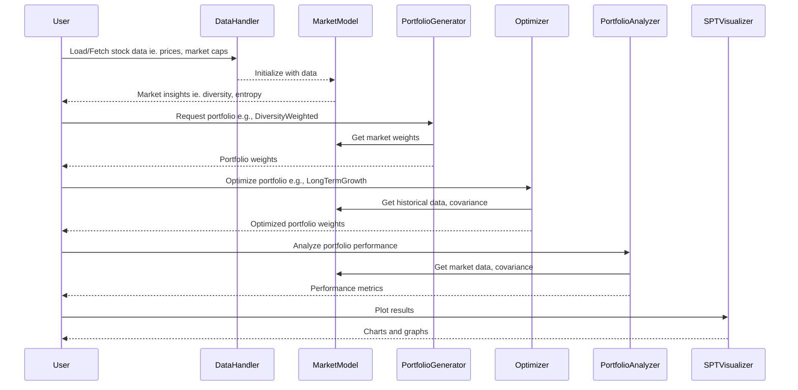

# Fernholz Stochastic Portfolio Theory (SPT) Library

[](https://badge.fury.io/py/fernholz-spt)
[](https://opensource.org/licenses/MIT)
<!-- [](https://fernholz-spt.readthedocs.io/en/latest/?badge=latest) -->

A Python implementation of E. Robert Fernholz's Stochastic Portfolio Theory framework. This library provides tools for researchers, quantitative analysts, and portfolio managers to analyze, optimize, and simulate equity portfolios using the mathematical framework of Stochastic Portfolio Theory.

> ⚠️ **WARNING: This project is a work in progress!** We have just started development and many features may be incomplete or unstable. If you'd like to contribute to this early-stage project, please feel free to create a pull request.

## Table of Contents

- [Introduction to Stochastic Portfolio Theory](#introduction-to-stochastic-portfolio-theory)
- [Key Features](#key-features)
- [Library Architecture](#library-architecture)
- [Typical Workflow](#typical-workflow)
- [Installation](#installation)
- [Quick Start](#quick-start)
- [Detailed Usage Examples](#detailed-usage-examples)
- [API Documentation (Overview)](#api-documentation-overview)
- [Mathematical Background](#mathematical-background)
- [Contributing](#contributing)
- [Citation](#citation)
- [License](#license)

## Introduction to Stochastic Portfolio Theory

Stochastic Portfolio Theory (SPT), primarily developed by E. Robert Fernholz, offers a descriptive framework for analyzing portfolio behavior and equity market structure. Unlike traditional normative theories (like Modern Portfolio Theory or Dynamic Asset Pricing), SPT does not assume market equilibrium or the absence of arbitrage. Instead, it focuses on the properties of portfolio value changes, market capitalization distributions, and the long-term growth of portfolios.

Key insights and tools from SPT include:

1.  **Functionally Generated Portfolios (FGPs):** Constructing portfolios whose weights are functions of market capitalization weights, leading to predictable relative performance under certain conditions.
2.  **Excess Growth Rate:** Quantifying how much a portfolio is expected to outperform or underperform another (often the market portfolio) due to its rebalancing strategy and the volatility of underlying assets.
3.  **Market Diversity and Concentration:** Analyzing how the distribution of capital among market constituents affects portfolio performance and the potential for relative arbitrage.
4.  **Rank-Based Portfolios:** Understanding market phenomena like the "size effect" by constructing portfolios based on the rank (e.g., by market capitalization) of stocks rather than their names.
5.  **Relative Arbitrage:** Identifying conditions under which one portfolio can outperform another with high probability, without necessarily being risk-free in an absolute sense.

This library aims to implement the core mathematical concepts from Fernholz's work, particularly his 2002 book "Stochastic Portfolio Theory" and related papers, making them accessible for practical portfolio management and academic research.

## Key Features

- **Market Model Implementation**:
  - Market weight dynamics modeling (using actual prices and market caps, with `yfinance` support for cap data).
  - Rank-based analysis (tracking how stock ranks change).
  - Diversity and concentration measures (p-diversity, entropy, HHI).

- **Portfolio Generation**:
  - Functionally generated portfolios (standard and custom `G(μ)` functions).
  - Diversity-weighted portfolios.
  - Entropy-weighted portfolios.
  - Rank-based portfolios (top-m, bottom-m, decile, leaking).

- **Optimization Tools**:
  - Long-term growth rate optimization.
  - Drift process maximization.
  - Diversity parameter optimization.
  - Rank-based portfolio parameter optimization.

- **Simulation Capabilities**:
  - Market weight simulation based on various stochastic processes.
  - Rank-based market simulation.
  - Stochastic process implementation (Brownian, fractional Brownian, Volterra).
  - Monte Carlo analysis for long-term performance.

- **Performance Analysis**:
  - Excess growth rate calculation.
  - Relative return calculation.
  - Turnover analysis.
  - Diversification metrics.

## Library Architecture



## Typical Workflow



## Installation

### Using pip (Recommended for users)

```bash
pip install fernholz-spt
```
*(Note: This will be available once the package is published to PyPI. For now, use "From source".)*

### From source (Recommended for developers)

```bash
git clone https://github.com/xaheli/fernholz-spt.git
cd fernholz-spt
pip install -e .
```

### Dependencies

The library requires the following core packages:
- `numpy`
- `pandas`
- `scipy`
- `matplotlib`
- `scikit-learn`
- `cvxpy`
- `yfinance` (for fetching market data)
- `seaborn` (for enhanced visualizations)

For a complete list with version requirements, see `requirements.txt`. Development dependencies (like `pytest`, `black`, `flake8`, `sphinx`) can be installed using `pip install -e ".[dev]"` if a `[dev]` extra is defined in `setup.py`.

## Quick Start

This example demonstrates loading stock data using `yfinance`, initializing the market model, creating a diversity-weighted portfolio, and analyzing its excess growth rate.

```python
import pandas as pd
import matplotlib.pyplot as plt
import yfinance as yf
from fernholz_spt.core.market_model import MarketModel
from fernholz_spt.core.portfolio_generation import FunctionallyGeneratedPortfolio
from fernholz_spt.simulation.performance_analysis import PortfolioAnalyzer
from fernholz_spt.utils.visualization import SPTVisualizer

# Define tickers and date range
tickers = ['AAPL', 'MSFT', 'GOOGL', 'AMZN', 'TSLA'] # Example: FAANG + Tesla
start_date = '2020-01-01'
end_date = '2023-12-31'

# Fetch price data using yfinance
price_data_list = []
for ticker in tickers:
    data = yf.Ticker(ticker).history(start=start_date, end=end_date)
    price_data_list.append(data['Close'].rename(ticker))
prices = pd.concat(price_data_list, axis=1).dropna()

# Market caps can be fetched similarly or provided as a DataFrame.
# For simplicity, MarketModel can use yfinance to fetch sharesOutstanding
# and compute market_caps if not provided.

# Initialize market model
# If market_caps=None, it will try to fetch shares outstanding via yfinance
# and compute caps as price * shares.
market_model = MarketModel(stock_prices=prices, market_caps=None, estimate_covariance=True)

# Create diversity-weighted portfolio
portfolio_generator = FunctionallyGeneratedPortfolio(market_model)
# Ensure p is between 0 and 1, e.g., 0.5 for sqrt weighting
diversity_portfolio_weights = portfolio_generator.diversity_weighted(p=0.5)

# Initialize portfolio analyzer
analyzer = PortfolioAnalyzer(market_model)

# Calculate excess growth rate
# Ensure diversity_portfolio_weights is cleaned (numeric, no NaNs) if necessary
# The portfolio generation methods should ideally return clean weights.
excess_growth = analyzer.calculate_excess_growth(diversity_portfolio_weights)

# Visualize results
fig_weights = SPTVisualizer.plot_weight_evolution(diversity_portfolio_weights.dropna(), top_n=5)
fig_weights.suptitle('Weight Evolution of Diversity-Weighted Portfolio (p=0.5)')
plt.show()

fig_drift = SPTVisualizer.plot_drift_analysis(excess_growth.dropna())
fig_drift.suptitle('Excess Growth Rate of Diversity-Weighted Portfolio (p=0.5)')
plt.show()

print("Excess Growth Rate (last 5 periods):")
print(excess_growth.tail())
```

## Detailed Usage Examples

*(These examples assume `market_model` has been initialized as shown in Quick Start or by loading data from CSVs.)*

### Market Model and Basic Analysis

```python
from fernholz_spt.core.market_model import MarketModel
import pandas as pd

# Assume prices_df is loaded (e.g., from CSV or yfinance from Quick Start)
# prices_df = pd.read_csv('stock_prices.csv', index_col=0, parse_dates=True)
# market_caps_df = pd.read_csv('market_caps.csv', index_col=0, parse_dates=True) # Optional

# Initialize market model with covariance estimation
market_model = MarketModel(
    stock_prices=prices, # Use prices from Quick Start
    # market_caps=market_caps_df, # Optionally provide market caps
    estimate_covariance=True,
    cov_window=252, # Annual window
    cov_method='shrinkage' # Ledoit-Wolf shrinkage
)

# Analyze market concentration (example for the last available date)
last_date = market_model.dates[-1]
concentration_top5 = market_model.calculate_concentration_ratio(last_date, 5)
hhi_index = market_model.calculate_herfindahl_index(last_date)
print(f"Top 5 Concentration on {last_date.date()}: {concentration_top5:.2%}")
print(f"HHI on {last_date.date()}: {hhi_index:.4f}")

# Analyze diversity measures (p-diversity)
# diversity is a DataFrame: index=dates, columns=['diversity_0.5', 'diversity_0.75', etc.]
diversity_series = market_model.diversity['diversity_0.5'] # Example for p=0.5
print("\nMarket Diversity (p=0.5) - last 5 periods:")
print(diversity_series.tail())

# Market Entropy
entropy_series = market_model.entropy
print("\nMarket Entropy - last 5 periods:")
print(entropy_series.tail())
```

### Functionally Generated Portfolios

```python
from fernholz_spt.core.portfolio_generation import FunctionallyGeneratedPortfolio
import numpy as np

# Assume market_model is initialized
fg_portfolio_gen = FunctionallyGeneratedPortfolio(market_model)

# Create different types of functionally generated portfolios
diversity_portfolio_p07 = fg_portfolio_gen.diversity_weighted(p=0.7)
entropy_portfolio = fg_portfolio_gen.entropy_weighted()
equal_portfolio = fg_portfolio_gen.equal_weighted()

# Custom generation function G(μ) using Fernholz's formula (Eq. 11.1 in F&K PDF)
# Example: G(μ) = (Σ μ_i^p)^(1/p), so log G(μ) = (1/p) log(Σ μ_i^p)
# This corresponds to the diversity-weighted portfolio.
p_custom = 0.5
def G_diversity(weights_array):
    # Ensure weights_array > 0 for power
    return np.sum(np.power(np.maximum(weights_array, 1e-12), p_custom))**(1/p_custom)

def grad_log_G_diversity(weights_array):
    # D_k log G = μ_k^(p-1) / (Σ μ_j^p)
    numerator = np.power(np.maximum(weights_array, 1e-12), p_custom - 1)
    denominator = np.sum(np.power(np.maximum(weights_array, 1e-12), p_custom))
    if denominator == 0: return np.zeros_like(weights_array)
    return numerator / denominator

custom_fpg_portfolio = fg_portfolio_gen.custom_generated_fernholz(
    generating_function=G_diversity,
    gradient_log_G_function=grad_log_G_diversity
)
# This custom_fpg_portfolio should be very similar to fg_portfolio_gen.diversity_weighted(p=0.5)

print("\nCustom FGP weights (last period):")
if not custom_fpg_portfolio.empty:
    print(custom_fpg_portfolio.iloc[-1].head())
else:
    print("Custom FGP portfolio is empty.")
```

### Rank-Based Portfolios

```python
from fernholz_spt.core.rank_based import RankBasedPortfolio

# Assume market_model is initialized
rank_portfolio_gen = RankBasedPortfolio(market_model)

# Create portfolios based on market cap ranking
top_10_cap_weighted = rank_portfolio_gen.top_m_portfolio(m=min(10, market_model.n_stocks), weighting='cap')
bottom_5_equal_weighted = rank_portfolio_gen.bottom_m_portfolio(m=min(5, market_model.n_stocks), weighting='equal')
smallest_decile_inv_cap = rank_portfolio_gen.decile_portfolio(decile=10, weighting='inverse_cap')

# Create a leaking portfolio (overweights small stocks)
# alpha (0,1) controls strength, higher alpha means stronger overweighting of small.
leaking_portfolio = rank_portfolio_gen.leaking_portfolio(alpha=0.7)

print("\nTop 10 Cap-Weighted (last period):")
if not top_10_cap_weighted.empty:
    print(top_10_cap_weighted.iloc[-1][top_10_cap_weighted.iloc[-1] > 1e-8]) # Print non-negligible weights
else:
    print("Top 10 cap-weighted portfolio is empty.")
```

### Long-Term Growth Optimization Example (Conceptual)
```python
from fernholz_spt.optimization.long_term_growth import LongTermGrowthOptimizer
import pandas as pd # Required for pd.Timestamp

# Assume market_model is initialized and has sufficient history
# For construct_optimal_growth_portfolio, it iterates over dates.
# This can be computationally intensive for long periods.
growth_optimizer = LongTermGrowthOptimizer(market_model)

# Example: Optimize for a single recent date with a lookback
if len(market_model.dates) > 252 and len(market_model.log_returns) > 252:
    target_date = market_model.dates[-1]
    # Ensure target_date has associated log_returns and market_weights
    if target_date in market_model.log_returns.index and target_date in market_model.market_weights.index:
        try:
            optimal_weights_single_date = growth_optimizer.optimize_growth_rate(
                date=target_date,
                lookback_window=min(252, len(market_model.log_returns.loc[:target_date])), # Adjust lookback
                regularization=0.01, # Small regularization
                min_weight=0.0,
                max_weight=0.20 # Max 20% in one stock
            )
            print(f"\nOptimal growth weights for {target_date.date()}:")
            print(pd.Series(optimal_weights_single_date, index=market_model.stock_names).nlargest(5))
        except ValueError as e:
            print(f"Could not optimize for {target_date.date()}: {e}")
        except Exception as e:
            print(f"An unexpected error occurred during optimization for {target_date.date()}: {e}")

# Optimize diversity parameter 'p' for diversity-weighted portfolio
# Using a shorter, representative period for optimization example
if len(market_model.dates) > 3*63: # Approx 3 quarters
    opt_start_date = market_model.dates[max(0, len(market_model.dates) - 3*63)] 
    opt_end_date = market_model.dates[-1]

    if pd.Timestamp(opt_start_date) < pd.Timestamp(opt_end_date) and \
       opt_start_date in market_model.log_returns.index and \
       opt_end_date in market_model.log_returns.index:
        
        params = growth_optimizer.optimize_functionally_generated_portfolio(
            start_date=opt_start_date,
            end_date=opt_end_date,
            portfolio_type='diversity',
            objective='sharpe' # Optimize for Sharpe ratio
        )
        optimal_p = params.get('diversity_parameter')
        if optimal_p is not None:
            print(f"\nOptimal diversity parameter (p) for Sharpe: {optimal_p:.3f}")
    else:
        print("\nNot enough aligned data for parameter optimization example.")
else:
    print("\nNot enough historical data for parameter optimization example.")

```

*(Market Simulation and detailed Performance Analysis examples would follow similar patterns, utilizing their respective classes from the library.)*

## API Documentation (Overview)

### Core Module (`fernholz_spt.core`)

-   **`MarketModel`**: Manages stock price/cap data, calculates market weights, ranks, diversity, entropy, and covariance.
    -   Key attributes: `stock_prices`, `market_caps`, `market_weights`, `ranked_weights`, `cov_matrices`, `diversity`, `entropy`.
    -   Key methods: `calculate_concentration_ratio()`, `calculate_herfindahl_index()`.
-   **`FunctionallyGeneratedPortfolio`**: Generates portfolios based on functions of market weights.
    -   Key methods: `equal_weighted()`, `market_weighted()`, `diversity_weighted(p)`, `entropy_weighted()`, `custom_generated_fernholz(G, grad_log_G)`.
-   **`RankBasedPortfolio`**: Constructs portfolios based on stock ranks.
    -   Key methods: `top_m_portfolio(m, weighting)`, `bottom_m_portfolio(m, weighting)`, `decile_portfolio(decile, weighting)`, `leaking_portfolio(alpha)`.
-   **`StochasticProcesses`**: Tools for simulating various stochastic processes (Brownian motion, GBM, fBm, Volterra).

### Optimization Module (`fernholz_spt.optimization`)

-   **`LongTermGrowthOptimizer`**: Optimizes portfolios for long-term growth or finds optimal parameters for FGPs/Rank-based portfolios.
    -   Key methods: `optimize_growth_rate()`, `construct_optimal_growth_portfolio()`, `optimize_functionally_generated_portfolio()`, `optimize_rank_parameters()`.
-   **`DiversityOptimization`**: Optimizes the `p` parameter for diversity-weighted portfolios.
-   **`DriftOptimization`**: Maximizes the drift process (excess growth rate) of portfolios.

### Simulation Module (`fernholz_spt.simulation`)

-   **`MarketSimulation`**: Simulates market dynamics and weight evolution.
-   **`PortfolioAnalyzer`**: Calculates performance metrics for portfolios (excess growth, relative returns, turnover).
    -   Key methods: `calculate_excess_growth()`, `calculate_relative_return()`, `analyze_turnover()`, `calculate_fernholz_metrics()`.

### Utils Module (`fernholz_spt.utils`)

-   **`DataHandler`**: Utilities for loading and preprocessing financial data from CSVs.
-   **`SPTVisualizer`**: Static methods for plotting weights, drift, returns, and other SPT-related visualizations.

## Mathematical Background

This library implements concepts from Fernholz's Stochastic Portfolio Theory. Key references include:
- Fernholz, E.R. (2002). *Stochastic Portfolio Theory*. Springer. (Cited as **Fernholz (2002)**)
- Fernholz, E.R. & Karatzas, I. (2009). *Stochastic Portfolio Theory: A Survey*. In: Handbook of Numerical Analysis. Elsevier. (Cited as **F&K Survey**)
- The overview PDF provided with the prompt ("Stochastic Portfolio Theory: an Overview" by Fernholz & Karatzas, Jan 10, 2008 - cited as **F&K PDF**)

### Key Concepts and Their Implementation

#### 1. Market Weights (μ) and Portfolio Weights (π)
-   **Market Weight** of stock *i*:
    $$\mu_i(t) = \frac{S_i(t)}{\sum_{j=1}^n S_j(t)}$$
    where $S_i(t)$ is the market capitalization of stock *i*.
    (F&K PDF, Eq. 2.1)
    -   Implemented in: `fernholz_spt.core.market_model.MarketModel._calculate_market_weights()`

-   **Portfolio Weights** $\pi_i(t)$ define the proportion of portfolio value in stock *i*. Must sum to 1.

#### 2. Growth Rates and Excess Growth Rate
-   **Logarithmic Representation of Stock Price:**
    $$d\log X_i(t) = \gamma_i(t) dt + \sum_{\nu=1}^d \sigma_{i\nu}(t) dW_\nu(t)$$
    where $\gamma_i(t)$ is the growth rate of stock *i*.
    (F&K PDF, Eq. 1.5)
    -   $\gamma_i(t) = b_i(t) - \frac{1}{2} a_{ii}(t)$, where $b_i(t)$ is the rate of return and $a_{ii}(t)$ is the variance of stock *i*. (F&K PDF, Eq. 1.4)
    -   The library primarily works with log returns: `MarketModel.log_returns`.

-   **Excess Growth Rate (Drift Process) of portfolio π relative to market μ (simplified form):**
    $$\gamma^*(\pi, \mu)(t) = \frac{1}{2} \sum_{i=1}^n a_{ii}(t) \left(\frac{\pi_i(t)}{\mu_i(t)} - 1\right)^2$$
    This formula uses the variances $a_{ii}(t)$ (diagonal elements of the covariance matrix $a(t)$ of stock log-returns). This specific form is often used for its simplicity and direct relation to relative weights.
    -   Implemented in: `fernholz_spt.simulation.performance_analysis.PortfolioAnalyzer.calculate_excess_growth()`
    -   **Note**: Fernholz (2002) and F&K PDF (Eq. 1.13) define the general excess growth rate of a portfolio $\pi$ as $\gamma_\pi^*(t) = \frac{1}{2} \left( \sum_i \pi_i(t) a_{ii}(t) - \sum_i \sum_j \pi_i(t) a_{ij}(t) \pi_j(t) \right)$. The library's `calculate_excess_growth` calculates a *relative* excess growth component based on variances.

#### 3. Diversity and Entropy
-   **p-Diversity of the market (μ):**
    $$D_p(\mu) = \left(\sum_{i=1}^n \mu_i^p\right)^{1/p}, \quad 0 < p < 1$$
    (Standard SPT definition, see Fernholz (2002), Chapter 7, or F&K PDF, Eq. 7.4 for $G_p(x)$ which is $D_p(\mu)^p$)
    -   Implemented in: `fernholz_spt.core.market_model.MarketModel._calculate_diversity()` (calculates $D_p(\mu)$ directly)

-   **Entropy of the market (μ):**
    $$H(\mu) = -\sum_{i=1}^n \mu_i \log \mu_i$$
    (Standard SPT definition, see Fernholz (2002), Chapter 11)
    -   Implemented in: `fernholz_spt.core.market_model.MarketModel._calculate_entropy()`

#### 4. Functionally Generated Portfolios (FGPs)
-   A portfolio $\pi$ can be generated from a positive, $C^2$ function $G(\mu)$ of market weights. The portfolio weights $\pi_i$ are given by:
    $$\pi_i(t) = \left(D_i \log G(\mu(t)) + 1 - \sum_{k=1}^n \mu_k(t) D_k \log G(\mu(t))\right) \cdot \mu_i(t)$$
    where $D_k \log G(\mu(t))$ is the partial derivative $\frac{\partial \log G(\mu)}{\partial \mu_k}$.
    (F&K PDF, Eq. 11.1)
    -   Implemented in: `fernholz_spt.core.portfolio_generation.FunctionallyGeneratedPortfolio.custom_generated_fernholz()`

-   **Diversity-Weighted Portfolio (special FGP):**
    Generated by $G_p(\mu) = (\sum_k \mu_k^p)^{1/p}$, leading to weights:
    $$\pi_i = \frac{\mu_i^p}{\sum_j \mu_j^p}$$
    (F&K PDF, Eq. 7.1 refers to this as $\mu^{(p)}(t)$)
    -   Implemented in: `fernholz_spt.core.portfolio_generation.FunctionallyGeneratedPortfolio.diversity_weighted()`

-   **Drift Process $g(t)$ for an FGP generated by $G(\mu)$:**
    The relative performance $V_\pi(T)/V_\mu(T)$ is related to $G$ and a drift $g(t)$ by the "master formula":
    $\log \frac{V_\pi(T)}{V_\mu(T)} = \log \frac{G(\mu(T))}{G(\mu(0))} + \int_0^T g(t) dt$
    where
    $$g(t) = -\frac{1}{2 G(\mu(t))} \sum_{i=1}^n \sum_{j=1}^n D_{ij}^2 G(\mu(t)) \cdot \mu_i(t) \mu_j(t) \cdot \tau_{ij}^\mu(t)$$
    $D_{ij}^2 G(\mu(t))$ is the Hessian of $G$, and $\tau_{ij}^\mu(t)$ is the covariance of log-market-weights relative to $\mu$.
    (F&K PDF, Eqs. 11.2, 11.3)
    -   $\tau_{ij}^\mu(t) = (\mu(t) - e_i)' a(t) (\mu(t) - e_j)$, where $a(t)$ is the covariance matrix of stock log-returns. (F&K PDF, Eq. 2.6)
    -   $g(t)$ implemented in: `fernholz_spt.core.portfolio_generation.FunctionallyGeneratedPortfolio.calculate_drift_process_fernholz()`
    -   $\tau_{ij}^\mu(t)$ implemented in: `fernholz_spt.core.portfolio_generation.FunctionallyGeneratedPortfolio._calculate_tau_mu_matrix_at_date()`

#### 5. Long-Term Growth Rate
-   The long-term growth rate of a portfolio $\pi$, $g(\pi)$, can often be related to the growth rate of the market portfolio $g(\mu)$ and an excess growth component:
    $$g(\pi) \approx g(\mu) + \text{average}(\gamma^*(\pi, \mu))$$
    Optimizing for $g(\pi)$ often involves maximizing this excess growth term subject to constraints.
    (Conceptual, based on F&K PDF, Chapter I, Section 1 and Remark 3.2 on portfolio diversification)
    -   Explored in: `fernholz_spt.optimization.long_term_growth.LongTermGrowthOptimizer`

## Contributing

Contributions are welcome! If you'd like to contribute, please follow these general steps:

1.  **Fork the repository** on GitHub.
2.  **Clone your fork** locally: `git clone https://github.com/YOUR_USERNAME/fernholz-spt.git`
3.  **Create a new branch** for your feature or bug fix: `git checkout -b feature/my-new-feature` or `bugfix/issue-tracker-bug`.
4.  **Install development dependencies** (if `[dev]` extras are set up in `setup.py`):
    ```bash
    python -m venv venv
    source venv/bin/activate  # On Windows: venv\Scripts\activate
    pip install -e ".[dev]"
    ```
    If not, install `pytest`, `black`, `flake8`, `mypy` manually.
5.  **Make your changes.**
6.  **Write tests** for your changes in the `tests/` directory.
7.  **Run tests**: `pytest tests/`
8.  **Format your code**: `black .`
9.  **Lint your code**: `flake8 .`
10. **Commit your changes**: `git commit -am 'Add some feature'`
11. **Push to your branch**: `git push origin feature/my-new-feature`
12. **Submit a Pull Request** from your fork's branch to the `main` branch of `xaheli/fernholz-spt`.

### Coding Standards

-   Follow PEP 8 style guidelines (enforced by `black` and `flake8`).
-   Add Type Hints (checked by `mypy`).
-   Write clear and concise docstrings for all public modules, classes, and functions (Google Style or NumPy style).
-   Include unit tests for new features and bug fixes.
-   Ensure mathematical correctness and consider numerical stability in implementations.

## Citation

If you use this library in your research, please cite it. As the library evolves, a Zenodo DOI might be provided. For now, you can cite the GitHub repository:

```bibtex
@software{Poddar_Fernholz_SPT_Python_2024,
  author = {Aheli Poddar and Shuvam Banerji Seal},
  title = {{Fernholz SPT: A Python Implementation of Stochastic Portfolio Theory}},
  url = {https://github.com/xaheli/fernholz-spt},
  version = {0.1.1}, # Adjust version as appropriate
  year = {2024} # Adjust year of first use or current version
}
```
And please cite the foundational works of Fernholz:
```bibtex
@book{Fernholz2002,
  author    = {E. Robert Fernholz},
  title     = {Stochastic Portfolio Theory},
  series    = {Applications of Mathematics},
  volume    = {48},
  publisher = {Springer},
  year      = {2002},
  doi       = {10.1007/978-1-4757-3694-8}
}

@incollection{FernholzKaratzas2009,
  author    = {E. Robert Fernholz and Ioannis Karatzas},
  title     = {Stochastic Portfolio Theory: A Survey},
  booktitle = {Handbook of Numerical Analysis},
  editor    = {Philippe G. Ciarlet},
  volume    = {15},
  pages     = {89--167},
  publisher = {Elsevier},
  year      = {2009},
  doi       = {10.1016/S1570-8659(08)00402-6}
}
```

### References

-   Fernholz, E.R. (2002). *Stochastic Portfolio Theory*. Springer.
-   Fernholz, E.R. & Karatzas, I. (2009). Stochastic Portfolio Theory: A Survey. In: *Handbook of Numerical Analysis* (Vol. 15, pp. 89-167). Elsevier.
-   Banner, A. D., Fernholz, E. R., & Karatzas, I. (2005). Atlas models of equity markets. *The Annals of Applied Probability*, 15(4), 2296-2330.
-   Fernholz, E. R., Karatzas, I., & Kardaras, C. (2005). Diversity and relative arbitrage in equity markets. *Finance and Stochastics*, 9(1), 1-27.

## License

This project is licensed under the MIT License - see the `LICENSE` file for details.

## Acknowledgements

This implementation draws inspiration from the original theoretical work of E. Robert Fernholz and subsequent contributions by him and his collaborators (notably Ioannis Karatzas, Adrian Banner, Constantinos Kardaras, and Tom Cover on related topics like universal portfolios).
```